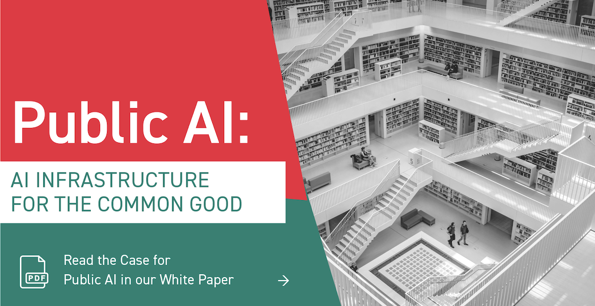

{:target="_blank" rel="noopener"}

## What is public AI?

Public AI is **AI as public infrastructure**: provisioned like electricity, water, roads, libraries, or the Internet itself.

- Public AI is **publicly accessible**: ensuring AI delivers benefits to all.
- Public AI is **publicly accountable**: ensuring AI reflects society's values.
- Public AI creates **permanent public goods**: ensuring AI is a reliable foundation.
- Public AI is being designed and built **right now** — all around the world.

[Learn more about our definition](https://publicai.network/whitepaper){:target="_blank" rel="noopener" class="button"}

## Why do we need public AI? 

- Limited public capacity in AI is stifling our collective capacity to shape the direction of society.
- AI is becoming essential infrastructure, like roads and water pipelines - fitting for the public sector.
- AI systems are growing in power and should reflect society's values, not the values of shareholders.
- Private companies have a head start. Without investment in public capacity now, the gap will grow.

[Learn more about the policy case here](https://publicai.network/whitepaper){:target="_blank" rel="noopener" class="button"}

## Who we are

The **Public AI Network** (PAINT) is a growing coalition working to bring about public AI. We aim to:

- Ensure public capacity-building is part of the conversation about AI design, policy, and funding
- Make it easier to build public AI by coordinating research efforts in the ML community
- Support policymakers and technical teams seeking to implement public AI
- Organize the broader movement for public AI

We host a Slack community which connects together experts from leading public AI labs, projects, and civil society groups. 
We also host many [events](#events) (see below) and a regular [seminar series](https://publicai.network/seminar) that shares insights from leaders in the field such as [Yoshua Bengio](https://archive.org/details/public-ai-bengio), [Diane Coyle](https://archive.org/details/public-ai-coyle), [Lawrence Lessig](https://archive.org/details/public-ai-lessig), and [Kim Stanley Robinson](https://www.youtube.com/watch?v=qQe7H9CY5Bw).

## Learn more

- What is public AI? Read the 2024 [White Paper](https://drive.google.com/file/d/1bcCPdRHyUGFB23--6wn4j1f9mRgdG2QF/view?usp=sharing){:target="_blank" rel="noopener"} or check out our [publications list](https://publicai.network/publications/){:target="_blank" rel="noopener"}
- How does it relate to open source? Read [our spotlight paper](https://arxiv.org/abs/2507.09296){:target="_blank" rel="noopener"} at ICML CodeML 2025
- Other questions? Look at our [seminar notes & recordings](https://publicai.network/seminar.html){:target="_blank" rel="noopener"}

## Getting involved

Public AI is a public, collaborative effort.

- For questions about public AI or to get involved, sign up for [the newsletter](https://publicai.substack.com){:target="_blank" rel="noopener"} or [contact us](mailto:hello@publicai.network){:target="_blank" rel="noopener"}!
- [We're recruiting](/jobs/) for specific roles, and always interested in working with aligned groups.  
- Our [original wiki document](https://docs.google.com/document/d/1ykjsXpTRZu4Obu9miJlkR9vIqWSLey5m0G4Utlm6HBg/edit){:target="_blank" rel="noopener"} describing public AI is publicly-editable. Suggestions welcome.
- To edit this site (e.g. to add an event or document), visit [our GitHub](https://github.com/manymodels/publicai.network){:target="_blank" rel="noopener"}.

## Events

### Upcoming events

Upcoming events are being planned in Zurich and Los Angeles.

### Past events

<table>
  <thead>
    <tr>
      <th>Date</th>
      <th>Event</th>
      <th>Location</th>
    </tr>
  </thead>
  <tbody>
    <tr>
      <td>Feb 27, 2026</td>
      <td><a href="https://luma.com/3fwdxk84" target="_blank" rel="noopener">Public AI Switzerland Founding Event</a></td>
      <td>Zürich, Switzerland</td>
    </tr>
    <tr>
      <td>Feb 21 2026</td>
      <td><a href="https://luma.com/21cshso9" target="_blank" rel="noopener">Karaoke Night</a> during the India AI Impact Summit</td>
      <td>New Delhi, India</td>
    </tr>
    <tr>
      <td>Feb 17–21, 2026</td>
      <td><a href="https://commonkhoj.org/" target="_blank" rel="noopener">AI Commons House</a> at Khoj Studios during the <a href="https://impact.indiaai.gov.in/" target="_blank" rel="noopener">India AI Impact Summit</a> week</td>
      <td>New Delhi, India</td>
    </tr>
    <tr>
      <td>Sep 9, 2025</td>
      <td>the first <a href="https://lu.ma/g9fafiq0" target="_blank" rel="noopener">Public AI quarterly call</a></td>
      <td><em>Online</em></td>
    </tr>
    <tr>
      <td>Jul 31, 2025</td>
      <td>Public AI: Policy, Community, &amp; the Future of National Labs. <a href="https://tpc25.org" target="_blank" rel="noopener">TPC 2025</a></td>
      <td>San Jose, CA</td>
    </tr>
    <tr>
      <td>Jul 16, 2025</td>
      <td><a href="https://lu.ma/7rjoaxts" target="_blank" rel="noopener">Oh Canada! A Public AI Happy Hour</a> at ICML 2025</td>
      <td>Vancouver, Canada</td>
    </tr>
    <tr>
      <td>Apr 26, 2025</td>
      <td><a href="https://lu.ma/6zeopix2" target="_blank" rel="noopener">Public AI Dinner &amp; Salon</a> at ICLR 2025</td>
      <td>Singapore</td>
    </tr>
    <tr>
      <td>Apr 24-25, 2025</td>
      <td>Commercializing Public AI at Barcelona Supercomputing Center</td>
      <td>Barcelona, Spain</td>
    </tr>
    <tr>
      <td>Apr-Jun, 2025</td>
      <td><a href="https://publicai.network/seminar.html" target="_blank" rel="noopener">Public AI Seminar Series</a>, Season 3 🎬</td>
      <td><em>Online</em></td>
    </tr>
    <tr>
      <td>Feb 12-15, 2025</td>
      <td><a href="https://docs.google.com/document/d/1IyP2jGob6Zxp1V7jjN1Ax--r45FHGYBgDhK31eoMNVU/edit?tab=t.0" target="_blank" rel="noopener">AI Action II</a> at Chateau du Fey</td>
      <td>Joigny, France</td>
    </tr>
    <tr>
      <td>Feb 11, 2025</td>
      <td>⭐ <a href="https://lu.ma/5h2x0n33" target="_blank" rel="noopener">Public AI Congress</a> and Public AI House at AI Action Summit</td>
      <td>Paris, France</td>
    </tr>
    <tr>
      <td>Oct 17-20, 2024</td>
      <td><a href="https://maifuture.pl" target="_blank" rel="noopener">mAIfuture</a> at the Cambridge Innovation Center</td>
      <td>Warsaw, Poland</td>
    </tr>
    <tr>
      <td>Oct 2, 2024</td>
      <td><a href="https://economicsecurityproject.org/news/blueprint-to-build-public-ai/" target="_blank" rel="noopener">Designing Public AI</a> at the Rockefeller Foundation</td>
      <td>Washington, DC</td>
    </tr>
    <tr>
      <td>Aug 13-14, 2024</td>
      <td>⭐ <a href="https://publicai.us" target="_blank" rel="noopener">Building a More Public AI Ecosystem</a></td>
      <td>Library of Congress</td>
    </tr>
    <tr>
      <td>Aug-Oct, 2024</td>
      <td><a href="https://publicai.network/seminar.html" target="_blank" rel="noopener">Public AI Seminar Series</a>, Season 2 🎬</td>
      <td><em>Online</em></td>
    </tr>
    <tr>
      <td>Jul 24, 2024</td>
      <td><a href="https://lu.ma/oxdb3ryc" target="_blank" rel="noopener">Public AI Social #4 (+ Fishing Expedition)</a></td>
      <td>ICML 2024</td>
    </tr>
    <tr>
      <td>Jul 15-21, 2024</td>
      <td><a href="https://www.aipalace.org/" target="_blank" rel="noopener">AI Palace 2024</a></td>
      <td>Bückeburg Palace</td>
    </tr>
    <tr>
      <td>Mar 13, 2024</td>
      <td><a href="https://lu.ma/mqop6d2c" target="_blank" rel="noopener">Public Visions for AI Workshop</a></td>
      <td>Newspeak House</td>
    </tr>
    <tr>
      <td>Jan-Feb, 2024</td>
      <td><a href="https://publicai.network/seminar.html" target="_blank" rel="noopener">Public AI Seminar Series</a>, Season 1 🎬</td>
      <td><em>Online</em></td>
    </tr>
    <tr>
      <td>Jan 8, 2024</td>
      <td><a href="https://lu.ma/qalguhzr" target="_blank" rel="noopener">Public &amp; Civic AI Social #3</a></td>
      <td>Newspeak House</td>
    </tr>
    <tr>
      <td>Dec 14, 2023</td>
      <td><a href="https://lu.ma/public-ai-dinner-party-neurips-2023" target="_blank" rel="noopener">Public AI Dinner Party</a></td>
      <td>NeurIPS 2023</td>
    </tr>
    <tr>
      <td>Nov 16, 2023</td>
      <td><a href="https://lu.ma/zo0vnony" target="_blank" rel="noopener">Public &amp; Civic AI Social #2</a></td>
      <td>Newspeak House</td>
    </tr>
    <tr>
      <td>Oct 17, 2023</td>
      <td><a href="https://lu.ma/public-civic-ai-social" target="_blank" rel="noopener">Public &amp; Civic AI Social #1</a></td>
      <td>Newspeak House</td>
    </tr>
    <tr>
      <td>Sep 21, 2023</td>
      <td><a href="https://archive.org/details/dweb-meetup-september-2023-ai-ethical-paths-forward" target="_blank" rel="noopener">Talk at AI: Ethical Paths Forward</a></td>
      <td>Internet Archive</td>
    </tr>
    <tr>
      <td>Sep 14, 2023</td>
      <td><a href="https://www.eventbrite.com/e/public-ai-seminar-tickets-716665073527" target="_blank" rel="noopener">Public AI Seminar</a></td>
      <td>NYU Engelberg Ctr</td>
    </tr>
    <tr>
      <td>Jul 3-10, 2023</td>
      <td><a href="https://www.aipalace.org/" target="_blank" rel="noopener">AI Palace 2023</a></td>
      <td>Bückeburg Palace</td>
    </tr>
  </tbody>
</table>

## Acknowledgements

A [wide range of people](https://docs.google.com/document/d/1ykjsXpTRZu4Obu9miJlkR9vIqWSLey5m0G4Utlm6HBg/edit#heading=h.v36dq6wln0nk){:target="_blank" rel="noopener"} have contributed ideas and time to the movement for public AI. We gratefully acknowledge operational support by [Metagov](https://metagov.org){:target="_blank" rel="noopener"}, [Aspen Digital](https://www.aspendigital.org/){:target="_blank" rel="noopener"}, [Open Future](https://openfuture.eu/){:target="_blank" rel="noopener"}, [Public Knowledge](https://publicknowledge.org){:target="_blank" rel="noopener"}, [Code for Science and Society](https://www.codeforsociety.org/){:target="_blank" rel="noopener"}, [Mozilla](https://mozilla.org){:target="_blank" rel="noopener"}, the [Rockefeller Foundation](https://www.rockefellerfoundation.org/), the [Internet Archive](https://archive.org){:target="_blank" rel="noopener"}, [Chatham House](https://www.chathamhouse.org/){:target="_blank" rel="noopener"}, the [Berkman Klein Center](https://cyber.harvard.edu/), the [Bertelsmann Foundation](https://www.bfna.org/){:target="_blank" rel="noopener"}, the [Patrick J. McGovern Foundation](https://www.mcgovern.org/), and many more organizations.

## License
 Work in this repository is licensed under the [Creative Commons Attribution-ShareAlike 4.0 International license](https://creativecommons.org/licenses/by-sa/4.0/){:target="_blank" rel="noopener"}.
