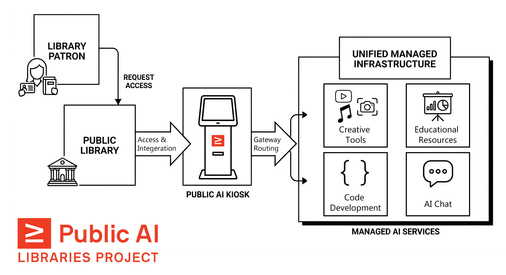

Public libraries have long served as trusted centers for information, learning, and community. We believe they can also shine as trusted providers of public AI: community-based AI services and infrastructure.

The Library of Congress, Metagov, and Public Knowledge, in partnership with the [Utah State Library](https://library.utah.gov/) and the [New Jersey State Library](https://www.njstatelib.org/), are launching a pilot program to bring **community-based AI services** to public libraries across the United States. This is your opportunity to join a national effort to make AI **more accessible and useful** for your community.

## The Library Pilot Program

We are inviting 6-8 libraries across the United States to join the pilot program in 2025-2026. The program began in Fall 2025 and is currently underway.

Each pilot site will receive:
- Access to a cloud-based Public AI workstation or kiosk experience that runs on an existing library computer
- Minimal setup, with deployments able to be up and running in less than 30 minutes
- A managed bundle of AI subscriptions for libraries and their patrons
- Public AI services for chat, coding, images, video, music, and presentations
- Access to AI infrastructure for organizing and localizing community data
- Opportunities to shape the future of public AI

Participating libraries are asked to contribute $1,000 per kiosk deployment per year.

Libraries will participate in storytelling, workshops, and a final presentation to local stakeholders and lawmakers.

## Our Mission

The Public AI Libraries Project is a nonprofit project dedicated to democratizing access to AI tools and resources through libraries and other educational institutions. We are a small team of technologists and librarians who believe that AI should be accessible to everyone without requiring expensive subscriptions or specialized devices.

We are part of the broader movement for public AI, alongside sister projects including the Public AI Network and the Public AI Inference Utility.

## What We Provide

We offer libraries and educational institutions bundled access to a curated suite of AI-powered tools and resources, including:
- **AI Chat** for research, learning, and general question answering
- **Code Development** tools for programming, prototyping, and app development
- **Creative Tools** for generating images, presentations, music, video, and other forms of media
- **Educational Resources** including presentations, documentation, and learning materials

We currently offer **two** deployment models: 1. direct integration with third-party AI interfaces and 2. custom Public AI interfaces that we manage and maintain ourselves. Both options are designed to be easy to set up and use, with minimal technical overhead for library staff.

Representative Public AI offerings include:
- [Public AI Chat](https://chat.publicai.co/)
- Coding development through services such as [Replit](https://replit.com/), with a typical retail value of *~$300* per year per user
- Creative tools such as [Midjourney](https://www.midjourney.com/), [Suno](https://suno.com/), and [Runway](https://runwayml.com/), with a typical retail value of *~$600* per year per user
- Educational and presentation tools such as [Gamma](https://gamma.app/), with a typical retail value of *~$100* per year per user

Explore the interface here: [libraries.publicai.co](https://libraries.publicai.co/index.html)

## How It Works

Public AI in libraries works much like other library services such as database subscriptions, media bundles, or makerspaces. Instead of each person paying for AI tools on their own, the library provides shared access in a supportive environment.

Our cloud-based setup runs on existing library computers and is designed to be plug-and-play for staff and patrons. We manage the bundle of services so libraries do not have to assemble and maintain separate AI subscriptions on their own.

## What You Need

For most deployments, libraries need:
- An existing library computer or kiosk with internet access
- A browser for accessing the Public AI interface
- A small amount of staff time for setup, testing, and local rollout
- If using PublicPass for shared-device access, staff and patron Chromebooks running Chrome with the appropriate extensions installed

## Privacy and Shared-Device Safety

We prioritize privacy and safe use in shared public environments. Public AI does not store patrons' conversations or generated content on its own platform; each linked AI service handles data according to its own privacy policy.

For shared-device deployments using PublicPass, libraries can use encrypted session handoff, session time limits, and auto-logout features to help protect patron privacy on shared devices. We recommend reviewing the privacy terms of each third-party service before rollout.

## Why Your Library?

- **You're already trusted.** Libraries are among the most respected institutions in the country.
- **You’re already experimenting.** From book clubs to grant-writing, libraries are exploring how AI can help.
- **You have the skills.** Librarians are information scientists and educators, ideal stewards of AI access.
- **You’re everywhere.** Libraries reach every corner of the nation. This is public infrastructure at its finest.

By providing AI tools through libraries, we can help ensure that:
- Students and researchers have equitable access to cutting-edge technology
- Educational institutions can integrate AI into learning without prohibitive individual subscription costs
- Communities benefit from AI literacy and digital skills development
- Knowledge remains accessible regardless of socioeconomic status

## Active Library Partners

Current library partners include:
- Sussex County Libraries, NJ
- Salem City Library, Utah
- Boston Public Library, MA
- Salt Lake City Library, UT
- Pottsboro Library, TX
- Osterville Village Library, MA
- Tremonton Public Library, UT
- ... and counting

## Support for Library Staff

We provide guidance, documentation, and training resources to help library staff introduce and support these tools in their communities. The program is designed to reduce technical and administrative overhead by offering a managed, curated bundle rather than asking each site to coordinate multiple tools independently.

## Get Involved

We are looking for libraries across **diverse regions and community types**. Ideal pilot libraries are:
- Excited to innovate and serve as AI hubs
- Committed to making technology work for everyone
- Eager to support community members in accessing new technologies

We envision a fast-paced, dynamic program where we iterate and co-design the software in partnership with members of the pilot program. Each applicant team should include one library director who can champion the project and one member of staff who is able to run it and serve as the regular point-of-contact.

## Quick Setup Guide

For most sites, setup is straightforward:
1. Choose the existing computer or kiosk where patrons will access Public AI.
2. Open the Public AI interface and verify internet access.
3. Configure any local bookmarks, shortcuts, or home-page settings for staff and patrons.
4. Install the admin and patron PublicPass extension from onboarding documents on respective devices for shared-device access.
5. Complete the first-time admin and user device setup.
6. Test a patron workflow before public launch.

For PublicPass-based deployments, the onboarding flow includes:
- Installing the Admin extension on staff devices and the User extension on patron devices
- Registering each admin and patron device once
- Sharing sessions securely from staff to patron devices
- Using session time limits and auto-logout to protect privacy on shared devices

Full onboarding instructions are available here: [PublicPass Onboarding Guide](https://libraries.publicai.co/extensions/onboarding/)

**Interested in being a pilot site?** [Apply with **this form**](https://forms.gle/FPJhXAhnZ4pcqwuT9). Decisions are rolling. 
Have questions or want to learn more? Reach out to: [hello@publicai.network](mailto:hello@publicai.network)

You can also review our [FAQ](https://libraries.publicai.co/faq.html) for additional details.

## What Is Public AI?

Public AI is AI as public infrastructure, like water, electricity, highways, public parks, and libraries. 
It is **open, accountable, and sustainably maintained**, providing meaningful access to all.

> “In labs, libraries, and legislatures around the world, the work to reignite our shared imagination by building Public AI has already begun.” — *Public AI White Paper (2024)*

## 🛠Partners

- [Library of Congress](https://loc.gov)
- [Metagov](https://metagov.org/)
- [Public Knowledge](https://publicknowledge.org)
- [Internet Archive](https://archive.org/)
- [Utah State Library](https://library.utah.gov/)
- [New Jersey State Library](https://www.njstatelib.org)
- More to be announced

## Learn More

- 📣 [Building a More Public AI Ecosystem @ Library of Congress](https://www.aspendigital.org/event/building-a-more-public-ai-ecosystem/)
- 🏛️ [Library of Congress Digital Strategy](https://loc.gov/digital-strategy)
- 📄 [Public AI White Paper](https://publicai.network/whitepaper)
