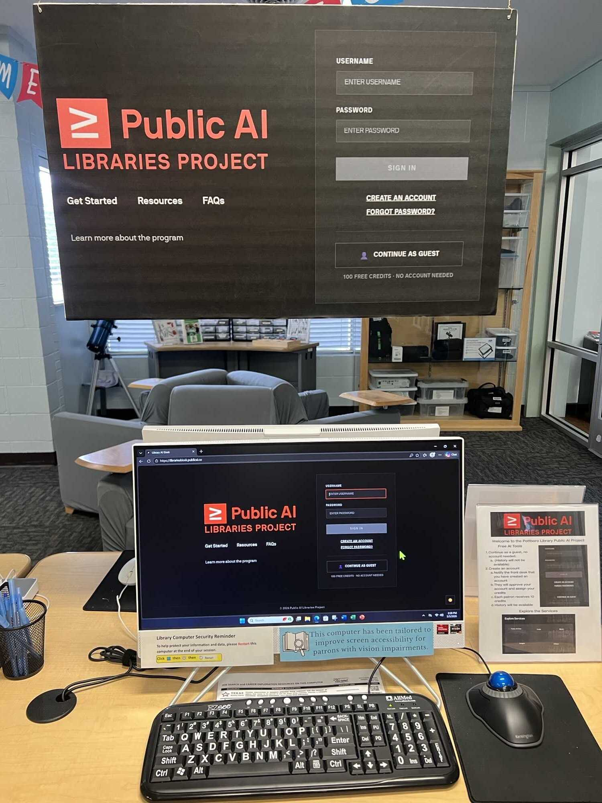

In a national effort to make AI more accessible and useful for all communities, the [Library of Congress](https://loc.gov), [Metagov](https://metagov.org/), and [Public Knowledge](https://publicknowledge.org), in partnership with the [Utah State Library](https://library.utah.gov/) and the [New Jersey State Library](https://www.njstatelib.org/), have launched a pilot program to bring **community-based AI services** to public libraries across the United States. We are part of the broader movement for [public AI](https://publicai.network)!

## Why Libraries?

Public libraries have long served as trusted community centers for information and learning, staffed by information scientists and educators who are stewards of responsible technology access. This is why libraries are already where millions of Americans go when private resources fall short: according to the Public Library Service survey data released in September 2025, public libraries had over 800 million visits in 2025 and over 155 million people accessed job search support, early childhood education, and countless other services at their local libraries.

Since 2011, public libraries have successfully transitioned patrons from passive consumers to active creators through makerspaces — community workshops that gave people access to 3D printers, laser cutters, recording studios, and fabrication tools they could never afford individually. Public AI is the next chapter in that same story: expanding the community toolkit from physical creation to digital and cognitive creation.

*Active deployment in Pottsboro, TX*

## The AI Kiosk

Each partner library has access to a cloud-based Public AI workstation, aka the 'kiosk', that runs on an existing library computer. Each kiosk offers a curated suite of AI-powered tools. The idea is that instead of each patron paying for AI tools on their own, the library provides shared access in a supportive environment.

We provide access to the following tools:
- **AI Chat** for research, learning, and general question answering
- **Creative Tools** for generating images, music, and videos
- **Code Development** tools for programming, prototyping, and app development
- **Educational Resources** including an interactive learning guide and library-vetted educational content

…and this is how we think these tools can help a patron:
- A local small business owner can use the chat tool to draft business plans, analyze market trends, or write grant applications.
- A student can use the same tool to learn about anything, ask any number of clarifying questions, and enhance their understanding of complex concepts.
- Students and professionals can produce high-quality music or videos, for school, work, or personal hobbies, without needing an expensive studio.
- A local shop owner can generate high-quality product photos or marketing materials (posters, social media ads) that would otherwise cost thousands in agency fees.
- Students and professionals can get coding support and learn to build websites or simple apps in a short span of time.

Participating libraries are asked to contribute $1,000 per kiosk deployment per year. Our kiosk is designed to be easy to set up and use, with minimal technical overhead for library staff.

## Privacy and Shared-Device Safety

We prioritize privacy and safe use in shared public environments. To that end, we are utilizing industry-leading Large Language Models (LLMs) that adhere to strict data protection and security standards. Furthermore, every patron gets a dedicated account that ensures their work and history are private to them. Public AI does not store patrons' conversations or generated content on its own platform.

## The Library Pilot Program

We invited libraries across the United States to join a limited pilot program in 2025-2026. The program is currently underway with several libraries.

**Active partners:**
- Sussex County Libraries, NJ
- Salem City Library, UT
- Salt Lake City Library, UT
- Tremonton Public Library, UT
- Pottsboro Library, TX
- Osterville Village Library, MA

**Engaged with libraries:**
- Boston Public Libraries, MA
- Cambridge Public Libraries, MA
- Maine State Library, ME
- Chicago Public Libraries, IL
- … and more

## Beyond the Kiosk

### What We're Working Toward

In the near term, we are focused on measurable outcomes: patrons who walk away having completed a real task such as working on a job application, crafting a business plan, or working on a creative project using AI tools they wouldn't otherwise have access to. We want library staff to become confident AI guides, reducing the barrier for community members who need a trusted human in the room.

In the longer term, we are building toward something more ambitious. As libraries begin to ingest and steward their own community knowledge — local history, local news, local voices — we hope for the kiosk to become a place where local knowledge is preserved and put to work for the people it belongs to. Ultimately, we believe that communities should own and govern their own knowledge and data through public infrastructure.

### Our Strategic Roadmap

<!-- TODO: convert roadmap to a graphic -->

**Phase 1 — The Kiosk**
- Implement a digital interface through which patrons can access different AI services.

**Phase 2 — Community Knowledge Infrastructure**
- Deploy infrastructure for data sovereignty, allowing libraries to ingest local knowledge and archives (history, local news, events, local personages).
- Deploy an interface for patrons to engage with the data.

**Phase 3 — Democratic Governance**
- Enable libraries to train models on their data.
- Deploy tools for patrons and librarians to vote on "Community Alignment" for local AI models.

## Get Involved

We are looking for libraries across **diverse regions and community types**. Ideal pilot libraries are:
- Excited to innovate and serve as AI hubs
- Committed to making technology work for everyone
- Eager to support community members in accessing new technologies

We envision a program where we iterate and co-design the software in partnership with members of the pilot program. Each applicant team should include one library director who can champion the project and one member of staff who is able to run it and serve as the regular point-of-contact.

**Interested in being a pilot site?** [Apply with **this form**](https://forms.gle/FPJhXAhnZ4pcqwuT9). Decisions are rolling. 
Have questions or want to learn more? Reach out to: [mohsin@publicai.co](mailto:mohsin@publicai.co)
